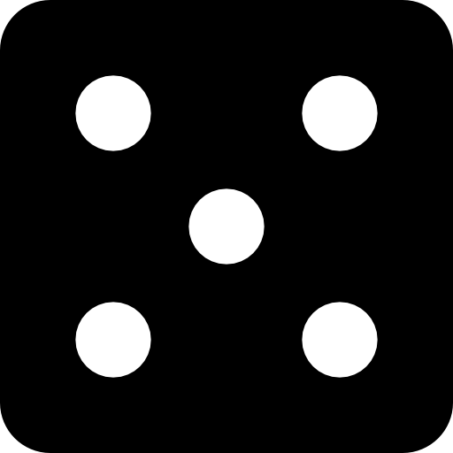

# Tension & Fate

## Tension Dice

Tension is the lifeblood of any good adventure. Watching characters endure challenges and overcome them is partly why people enjoy them so much. Tension Dice represent a way for the Storyteller to add additional challenge into the player’s journey.

At the beginning of an adventure, the Storyteller begins play with a **maximum of 6 Tension Dice**. When a Test is made by the players, the Storyteller can spend some or all of their Tension Dice to affect the Test’s Challenge Rating. Each success obtained from using Tension Dice increases a Test's challenge rating by 1.

>The Storyteller declares they are using Tension after a character makes a Test at CR 2. The Storyteller spends 3 of their Tension Dice and obtains the result below. As a result, the challenge rating of the Test increases to CR 4.

When the Storyteller uses Tension Dice, the characters affected by the outcome gain the option to immediately respond through the use of vigor. If only one character is affected, then another character may choose to respond either by invoking the aspect associated with the test or coming up with a new Test that would give them the number of successes needed to help out their companion.

Tension Dice, like with regular rolls, can earn pushes as well. These rolls can also result in Majors or Minors as if the Storyteller were spending vigor.

A **Minor Success** occurs when all Tension Dice rolled result in a success. A Minor Success indicates a favorable opportunity for the antagonists and increases the Challenge Rating of an obstacle by 1 for each success and then by 1 more by virtue of being a Minor Success. So if the Storyteller uses Tension Dice and gains a Minor Success with 3 dice like the example shown below, then the difficulty of the challenge increases by 4 for that Test.

A **Major Success** occurs when all dice rolled land on a 6 and represents an incredible stroke of luck for the antagonizing force. When a Major Success is rolled, the number of successes are counted and then doubled before being added to a Challenge Rating. So if a Major Success is achieved with 3 dice like as shown below, then the result increases a given Challenge Rating by 6.

A **Minor Blunder** occurs when all dice rolled result in a blunder. A Minor Blunder indicates the occurrence of an inconvenience on the behalf of the antagonizing side. When a Minor Blunder is rolled, the Challenge Rating of a given obstacle is reduced by 1.

A **Major Blunder** occurs when all dice rolled land on a 1. A Major Blunder indicates that a significant misfortune has happened to the antagonists. When a Major Blunder is rolled by the Storyteller, the Challenge Rating being affected is reduced by the number of dice rolled in the Major Blunder. So if a Storyteller rolled a Major Blunder with 3 dice like as shown below, then the relevant Challenge Rating would be decreased by 3 for that Test.

### Regaining Tension Dice

A Storyteller can regain Tension Dice through the course of play just as players can regain vigor. Tension Dice can also be restored through one of three ways: 
- A player has completed a Local or World action
- A round of an Engagement has been completed
- A Downtime action has been completed

Whenever one of the three conditions has occurred, the Storyteller's Tension Dice fully restore.

>The party uses a Local action to Interact with a Location. They decide to invoke their Resolve Aspects to talk with some of the locals regarding information on the target they're pursuing. The Storyteller spends 3 Tension Dice on the Test which results in a negation of a few successes. Once the party has accepted the final result, the action is considered completed. The Storyteller's Tension Dice pool then restores completely.

### Increasing Tension Dice

Over the course of a campaign, the maximum number of Tension Dice that a Storyteller can hold can be increased beyond the starting 6.

When a Calamity manages to increment their Clock upon completing a step necessary for their plan and _the characters are informed of the increment within the game_, the Storyteller’s Tension Dice maximum increases by 1. Might help to point out to the page with a Clock is so they can understand what it is.

To put it into context, imagine a situation where a Dark Lord’s minions manage to defeat a prominent kingdom while the player characters are thwarting them in another location. Once the player characters have been informed of this event by either a refugee or a traveling merchant, the Storyteller’s Tension Dice maximum increases by 1.

### Resetting Tension Dice

Just as Tension Dice can be gained, they can also be reset back to the original cap of 6 through the course of gameplay. If the players manage to succeed on an adventure and thwart a step of a Calamity’s Clock, then the Storyteller’s Tension Dice are reduced by 1. In this fashion, a Storyteller’s Tension Dice can never fall below 6.

## Fate Points

Fate points are a pool of points similar to a player character’s vigor. Fate points allow a Storyteller to directly hinder an action made by one of the players in lieu of using Tension dice. And unlike Tension dice, Fate points are persistent throughout the entire game and do not reset at the end of a turn. A Storyteller begins the game with **zero fate points** and accrues more by offering characters twists of fate. 

A **_twist of fate_** can be offered whenever a character is in a critical situation but has depleted their vigor and resources. Perhaps they are hanging off the edge of a cliff or need just a few more successes in order to avoid receiving a lethal blow. When this happens, the Storyteller can step in and offer the afflicted player a twist of fate. This grants the afflicted character the amount of successes they need to avoid the incoming peril. In exchange, the Storyteller receives an equal amount of fate points to use in any later challenge.

>A character has started a Test to try and cross an unstable bridge. The bridge is a peril and failure to cross will result in them falling a lethal distance into the torrential river far below. The Storyteller declares the challenge of crossing the unstable bridge to be CR 4. The player invokes Finesse to cross the bridge but through unlucky rolls only manages to obtain 1 success.
>
>Seeing this, the Storyteller steps in and offers a twist of fate; They will grant the player the 3 successes they need but in exchange the Storyteller will gain 3 fate points to use in a later challenge.

### Using Fate Points
Like Tension Dice, Fate points can be used any time a player makes a Test. When this occurs, the Storyteller announces a twist of fate and then spends however many Fate points to increase the CR of the challenge. Unlike Tension Dice, these points are not rolled and directly add to the Test's challenge rating.

>A character has made a Slash Weapon action and obtained five successes against an opponent's two resistance. The Storyteller steps in an announces a twist of fate where a sudden gust of wind caused the blade's impact to be softened. They take the 3 Fate Points from before and add them to the opponent's resistance.

Fate points can also be used to increase the damage of an opponent's attack.

>An enemy swordsman makes a Pierce Weapon action against a player character using their spear and only gains one success to create pressure. The Storyteller steps in and declares a twist of fate. Using 3 Fate points, they add 3 successes to the swordsman's action.

When a twist of fate is used against a player character, the player has the option of responding with an additional use of vigor or awaiting assistance from one of their companions.
