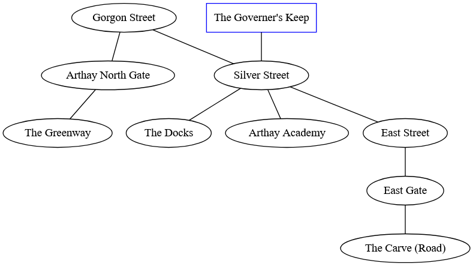
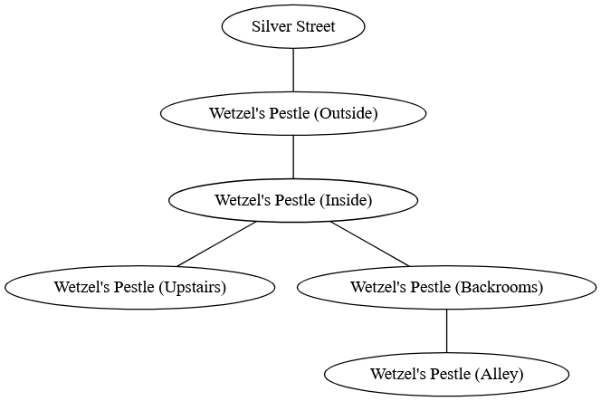

# Best Laid Plans
At this point you've either skipped the preceding chapters to figure out how the game is run or you've followed along with ideas percolating in your mind regarding the kind of adventure you woud like to run. This section is intended to teach you how to run the game and techniques for responding to the actions of the players that keep the game fun and help you have an easier time running the show.

## Example Adventure
For this chapter, we'll be using the example adventure below. Whenever we introduce a concept or technique, we'll make references to this specific plot to serve as an example.

>**Who**: The antagonist is a dwarf named Faerlasdar who commands a group of dwarf pirates. Their first mate is Dranz Llewellyn, a wyrm.
>
>**Why**: Revenge! Faerlasdar wants revenge on the governer who banished them from his service. Now that the pirate has acquired a magic tome, they plan to usurp the Governer!
>
>**What**: A Supernatural Army! Faerlasdar wants to summon a supernatural army capable of overpowering the guards and knights within the port town of Arthay.
>
>**When**: In 3 days under the cover of night and just before dawn! 3 Downtime Actions and 6 World actions from now, Faerlasdar will have summoned his army.
>
>**Where**: In an abandoned classroom at Arthay Academy. In the meantime, Faerlasfar is hiding on a pirate vessel moored two miles from the city.
>
>**How**:
> What are the steps Faerlasdar needs to complete in order to succeed at their plan?
>|Steps|The antagonist and their subordinates must...|
>|-|-|
>|Step 1|They must gather together the magical components to summon their supernatural army|
>|Step 2|Then they must recite from a magical book just before dawn breaks|
>|Step 3|Unleash the Supernatural Army upon the city of Arthay|
>|Step 4 (Optional)|--|
>|Step 5 (Optional)|--|
>|Step 6 (Optional)|--|

### **Arthay**

### **Clues**
**THE LIST OF MAGICAL INGREDIENTS**
>**Location**: On the floor of a looted wizard's shop (Crime Scene)
>
>**Form**: A piece of parchment (Writing)
>
>**Challenge**: Open Challenge to determine the nature of the ingredients and where to find them.
>
>**Information**: **What** - The list of ingredients corresponds to ones used in summoning supernatural creatures.
>
>**Additional Details**: **Trait** - The list was written in scribbly hand-writing because Faerlasdar is a pirate and not well-learned.

**RUMORS OF THE DREAD PIRATE'S RETURN**
>**Location**: A bystander (Supporting Character)
>
>**Form**: Gossip (Dialogue)
>
>**Challenge**: None
>
>**Information**: **Who** - Rumors concerning the Dread Pirate Faerlasdar have been surfacing around the town of Arthay. Faerlasdar once served the governer of Arthay but was banished for taking things too far (**Why**).
>
>**Additional Details**: None

**SOMEONE'S OUT FOR THE GOVERNER**
>**Location**: Posters around Arthay (Crime Scene)
>
>**Form**: Posters depict the governer's image but with slashes or nooses around their neck (Writing)
>
>**Challenge**: None
>
>**Information**: **Why** - Someone in Arthay (Faerlasdar) does not view the governer favorably.
>
>**Additional Details**: None

**MIXING UP WITH PIRATES (EVENT)**
>**Location**: Break-in at the Alchemist's Shop (An Event)
>
>**Form**: Dialogue
>
>**Challenge**: Engagement / Chase - Faerlasdar's minions are assailing the shop. If at least one of them can be captured, then they may be willing to give up information.
>
>**Information**: **What** - All the minions know is that Faerlasdar needs specific reagents for a ritual. The ritual will summon creatures to help him take over Arthay. He needs the ingredients before dawn in 3 days (**When**). The minions do not know where though, only that he is looking for somewhere in the city that is abandoned (Unlocks "Abandoned Locations in Arthay"). If the players are convincing enough, they may learn of Faerlasdar's moored vessel outside of town (**Where**)
>
>**Additional Details**: **Trouble (Distrustful)** - Faerlasdar doesn't fully trust his crew. Therefore he has kept certain information from them like how the ritual also needs a blood sacrifice.

**ABANDONED LOCATIONS IN ARTHAY**
>**Location**: Local Knowledge (Knowledge)
>
>**Form**: None (Knowledge)
>
>**Challenge**: Open Challenge to learn about abandoned locations.
>
>**Information**: **Where** - The list of locations in Arthay where Faerlasdar could be staging the ritual.
>
>**Additional Details**: **Trait** - The list was written in scribbly hand-writing because Faerlasdar is a pirate and not well-learned.

### **The Hook**
*Active Hook*

A local elfling wizard named Mogorn Varkellit recently had their magical shop *Morgon on Gorgon* plundered by a group of vagrants. They have made a post with the local garrison for a group to investigate the crime and find the perpetrators.

The player characters are hooked into the adventure by:
- Knowing Morgon Varkellit and understanding they are a helpful member of the town.
- Have a deal with the local government to reduce the length of their punishment by helping in this task.
- Seeking a portion of the reward Morgon is offering for each magical reagent recovered from the perpetrators.

## Running the Game
Now that we have our starting adventure here, we begin play by introducing the characters to the Hook. In some form or fashion, the characters benefit from helping Morgon Varkellit look for the stolen items.

In this scenario, the players begin play with a clue ("**THE LIST OF MAGICAL INGREDIENTS**"). Here, invite the players to examine the list of ingredients. This is an Open Challenge:
- A Memory Test at CR 3 reveals the remaining ingredients on this list can be found at Wetzel's Pestle on Silver Street.
- An Insight Test at CR 3 reveals that many of the reagents on the list are often associated with powerful summoning rituals.

These Tests can be enhanced if a character possesses a rating in Occult knowledge or is experienced in a relevant Trade.

If the characters manage to fail, assure them that they may be able to search around for a place that carries these ingredients.
- Asking citizens of Arthay would reveal Wetzel's Pestle and Morgon on Gorgon's to be the likely places to find such ingredients.
- Alternatively, the party can make a Sense Test at CR 3 where everyone rolls their Sense ratings together in order to find the establishment.

**Tests and Movement**

This is a good point to recall how Local actions work within Mythmaker. The map of Arthay above shows the general layout of the town with each shape representing an area.

Moving between areas requires the use of movement which in turn requires the characters to spend a Local action to "Explore a Location". This grants the characters movement equal to their $Size + Endurance$. However, this allows them to spend a point of movement as a Free action to go from one area in Arthay to another.

Making a Memory or Inight Test is a free action since thinking doesn't consume much time or energy. However, if the characters fail and choose to make a Sense Test to look for a location where the ingredients can be found, then this would require them to "Interact with a Location" since it takes time to search an area. The results of the Sense Test they make only applies to the area they are in. If they move to a new area, they will have to make a new Sense Test.

**Actions and Time**

Whenever a Local or World action completes, that is when you as the Storyteller dictate the results of a Test, the clock advances.

If one character has completed a total of four Local actions, the World clock advances once the results of the last Local action are finalized. Note that this is not the same as if four Local actions were made by different characters at the same time.

### Wetzel's Pestle
At some point or another, the characters will be making their way towards the next Clue ("**MIXING UP WITH PIRATES**").

As the clue describes, the location of Wetzel's Pestle is being plundered by four members of Dread Pirate Faerlasdar's crew as the player characters arrive. A few guards have been slain and two of the pirates walking out of the store have full leather sacks over their shoulders.

#### **Engagements**
Now it's time to begin an Engagement as these pirates are aiming to be in and out as quick as possible. To start the Engagement, take the Insight ratings of each player and make a list of their names in descending order. This list acts as the **Turn Order**.

The dwarf pirates are CR 1 which means that all of their aspects are rated at 1, including their Insight. If a player's Insight score matches the dwarf pirates, then they go first as players have turn order priority.

**When It's Your Turn**
Characters and enemies take their turns according to the Turn Order. When it's a character's turn, they gain the ability to do any of the following:
- Make up to 3 Free actions
- Make one Contested Action
- Make as many Move Actions as their $Size + Endurance$ allows

A Free Action is an action that has no obstacles associated with it and costs no vigor. In an Engagement, a given creature can only make three Free Actions per Turn.

| Free Action | Description                                                                                                                                                                                                                                                                                                                                                   |
| ----------- | ------------------------------------------------------------------------------------------------------------------------------------------------------------------------------------------------------------------------------------------------------------------------------------------------------------------------------------------------------------- |
| Speak       | Speaking within an engagement produces a short amount of dialogue that can be used to signal intent, speak with the opposing party, or relay information to one's allies. When a creature uses a Free Action to speak with another creature, the receiving creature may reply for free without consuming their own Free Actions.                              |
| Perceive    | Perceiving allows a character either to make an Memory Test to overcome a hindering element of the environment or make an observation and acquire details about a present area, creature, or object. If they possess a relevant knowledge or profession, they can also make an Memory Test to learn any details or clues regarding a creature or situation. |
| Rest        | A rest allows a creature to increase their Recovery and Health by 1. This is negated if the character spends vigor, takes wounds, makes a Contested Action, or makes a Move Action during their turn.                                                                                                                                                         |
| Interact    | Drawing a weapon, opening an unlocked door, or grabbing an object from a character's own pack                                                                                                                                                                                                                                                                 |
| Use Item    | Using an item other than a weapon such as a potion or a specific tool.                                                                                                                                                                                                                                                                                        |

### Contested Actions
Contested Actions are actions that are obstructed by some obstacle and require the use of a Test and possibly even vigor in order to overcome them. A given creature can only start one Contested Action per Engagement turn.

When a character starts a Contested Action against a target, they make a Test to generate pressure based on the action they are performing. Pressure is negated by a target's resistance towards that given type which can either be generated during the initial Test or during the target's Turn.

| Contested Action | Description                                                                                                                                                                                                                                                                                                                 |
| ---------------- | --------------------------------------------------------------------------------------------------------------------------------------------------------------------------------------------------------------------------------------------------------------------------------------------------------------------------- |
| Use Weapons      | Use held armaments to make Weapon actions equal to the number of held weapons in order to either create physical pressure towards another creature or create resistance against incoming pressure. The Weapon actions available character has available to them depends on the held Weapon’s class (Melee, Ranged, Shield). |
| Impair           | Apply an Aspect to create conditional pressure.                                                                                                                                                                                                                                                                             |
| Recover          | Apply an Aspect to reduce impairing pressure caused by an Impairment.                                                                                                                                                                                                                                                     |
| Maneuver         | Apply an Aspect to perform a special maneuver                                                                                                                                                                                                                                                                               |
| Retreat          | Signal a Retreat that other players can immediately respond to. This turns the Engagement into a Chase.                                                                                                                                                                                                                     |
| Focus            | Use a Supernatural Practice to create a supernatural effect by spending vigor or resources to accrue focus points.                                                                                                                                                                                                          |

When everyone in the Turn Order has gone, all pressure placed upon a character is accounted for with different types of pressure resulting in different effects.

| Pressure           | Effect                                                                                                                                                                                                                       |
| ------------------ | ---------------------------------------------------------------------------------------------------------------------------------------------------------------------------------------------------------------------------- |
| Physical Pressure  | Subtracts from a character's Vitality rating during the World's Turn. If a character's Vitality rating reaches 0, then any further pressure is subtracted from their vigor instead and must make Resolve Checks to stay conscious                    |
| Natural Pressure   | Mainly consists of Fire, Cold, and Acid. Fire Pressure, Cold Pressure, and Acid Pressure are accounted for individually. Seek their entries in the Impairments section for more information.                                 |
| Impairing Pressure | A character receives an impairment during their next Turn equal to the amount of Impairing Pressure they have received. The effects of this depends on the specific Impairment which can be found in the Impairments section |

#### **Use Weapons**
A character can make a number of Weapon Actions equal to the number of held weapons in their hands. A swashbuckler wielding a rapier in one hand and a dagger in the other, for instance, can make two Weapon Actions. A berserker wielding just a single greatsword on the other hand would only be able to take make one Weapon action.

##### **Standard Melee Weapon Actions**
| Weapon Action | Invoked Aspect | Creates...          |
| ------------- | -------------- | ------------------- |
| Slash         | Strength       | Physical Pressure   |
| Pierce        | Finesse        | Physical Pressure   |
| Bludgeon      | Strength       | Physical Pressure   |
| Throw         | Finesse        | Physical Pressure   |
| Brace         | Strength       | Physical Resistance |
| Parry         | Finesse        | Physical Resistance |

##### **Standard Ranged Weapon Actions**
| Weapon Action | Invoked Aspect | Creates...        |
| ------------- | -------------- | ----------------- |
| Aim           | Finesse        | Base Range        |
| Loose         | Finesse        | Physical Pressure |

##### **Standard Shield Weapon Actions**
| Weapon Action | Invoked Aspect | Creates...          |
| ------------- | -------------- | ------------------- |
| Bludgeon      | Strength       | Physical Pressure   |
| Throw         | Finesse        | Physical Pressure   |
| Brace         | Strength       | Physical Resistance |
___
Slash, Pierce, and Bludgeon are standard weapon actions that allow a character to invoke the aspect associated with them towards creating physical pressure. Physical pressure is potential damage that a target may receive at the end of the Engagement Turn when all pressure is added together. 

If a character satisfies the Strength Requirement of a given weapon, they can use the weapon's size rating as Enhancement towards the Test. A weapon will state which of the three actions its capable of performing. It is possible to attempt make a weapon action a weapon is not normally capable of but doing so results in the Test being hindered by 1.

The target on the receiving end of this physical pressure must then make an Armor Test. If the target's Armor Set has a physical vulnerability to the Weapon Action being made against them, then the Armor Rating of the Armor Set is rolled to generate resistance. However, if the Armor Set does not have a physical vulnerability to the Weapon Action, then the target's Armor Rating acts as the de facto challenge rating. If the amount of physical pressure created is more than the resistance of the target, then the target is *under pressure* and cannot use their Move Actions to shift away until the pressure is negated either on their turn or by an ally.
___
Brace and Parry are standard weapon actions that allow a character to invoke the aspect associated with them to create physical resistance. If a character is under pressure, then they must use a Weapon Action to Brace or Parry to try and remove pressure if they wish to move around freely.
___
Throwing can be performed with any object. In order to throw a weapon or item at a target, the target must be within the throwers base range. The default base range for any creature is anything within the same zone. A creature's base range increases by 1 zone for every point that their Strength exceeds the object's size rating that they are trying to throw. However, if this condition is not satisfied, the creature can make a Contested Action to make a Strength Test with the object's size as the challenge rating. If they succeed, they can throw the object one additional zone away from where they are.

Once a target is inside the base range, the creature making the throw makes a Finesse Test. If the creature's Strength Rating is less than the size rating of the object, then the Finesse Test is hindered by the object's size rating. However, if the throwing creature's Strength is equal or greater than the object's size, then no hindrance is applied. The type of Weapon Action being performed on the target is whatever makes sense in the moment. For example, if a mug is being thrown at a rowdy tavern patron, then Bludgeon applies. However, if someone is throwing a dart or a dagger, then Pierce applies.

### Movement
A Move Action allows a creature to move from one zone to another. A zone is a defined area within a given location. For example, the image below depicts the area around Wetzel's Pestle. During your Turn, you can move a number of areas equal to your character’s Size rating plus their Endurance rating. A character can move beyond this allotted amount by spending one point of vigor and subtracing one point from Recovery for each additional zone traveled.

A character can make the following Move Actions in addition to moving from area to area:
| Move Action     | Description                                                                                                                                                                                                                                                                                                                                                                                                                                                             |
| --------------- | ----------------------------------------------------------------------------------------------------------------------------------------------------------------------------------------------------------------------------------------------------------------------------------------------------------------------------------------------------------------------------------------------------------------------------------------------------------------------- |
| Move into Cover | Spend a Move Action to shift behind available cover in a given zone. The Storyteller will describe what is available to you and how much cover it provides. Generally, only one creature can occupy a source of cover unless otherwise stated. A cover's provided size rating acts as Enhancement towards any Armor Tests or Contested Actions made while in cover. However, melee weapon actions are hindered equal to the size rating of the cover while it is in use |
| Leave Cover     | A creature behind cover must spend a move action to move out of cover in a given zone. The creature loses the benefits of cover but their melee weapon actions are no longer hindered                                                                                                                                                                                                                                                                                   |

### Delay Turn
A delay allows a creature to suspend their turn until after another creature in the turn order has gone. A delayed Turn can only be started after another creature has already performed their actions. The character's placement in the turn order resets once a new Turn has been started.

Delaying a Turn can prove useful when coordinating efforts against particular foes or for observing how an Engagement unfolds before choosing to step in.

## Running the Dwarfs
A given creature, such as the four pirate dwarfs the characters are fighting in this encounter, have access to all of the same actions and abilities as characters do. What defines a creature from a character is the creature's CR.

When a creature has a CR (Such as the dwarfs who have CR 2) it means that all aspects for that creature share the same rating unless otherwise stated. The Health of a creature is equal to double its CR value. Likewise, Movement is equal to its Size rating plus its CR.

A creature, like characters, can wear Armor Sets and wield weapons. In the case of these dwarf pirates, their sheet looks like this:

>**Creature**: Dwarf Pirate, **CR**: 2, **Health**: 4, **Movement**: 6
>
>**Armor Set**: Leather Hide (**AR** 1, **Cold** 1 **Fire** 1 **Acid** 1, **Vulnerability**: SPB)
>
>**Weapon**: Iron Cutlass (**Light**, Size 1, **Weapon Actions**: SP)
>

Just to refresh, here's a summary of the terms above:
- **AR** (Armor Rating) - The value referenced whenever an Armor Test is made. If a character is on the receiving end of a weapon action that matches one of the Armor Set's vulnerabilities, then an Armor Test is rolled with a number of dice equal to the rating. In the case where the weapon action is not among an Armor Set's vulnerabilities, this value is not rolled and instead counts as Ease.
- **SPB** (Slash/Pierce/Bludgeon) - The weapon actions that a weapon can make or that an Armor Set is vulnerable to.

In addition, any time the dwarf pirates make a weapon action of their own, the action is enhanced by the size rating of the weapon (1) due to their Strength being higher than the weapon's size.

## Dwarf Pirate Tactics
On the dwarf's turns, they will attempt to make Slash or Pierce attacks against whoever seems like a good target. Each of them will try to take on their own member of the party if they can. However, if a dwarf's Health is brought to zero, then they will immediately surrender.

When a dwarf is brought to a Health of 2 or lower, they will immediately surrender and try to barter for their lives.

## Using Tension
As the Storyteller, you have access to a special dice pool known as Tension. At the beginning of this adventure, you started with a Tension pool of 6. This Engagement provides an opportunity to use some of them.

Tension can be used to enhance the results of an antagonist's rolls or to either increase the challenge rating of an obstacle before the players.

For example, when one of the dwarf pirates makes an attack on a player, you can declare after the roll that you are using Tension. 

When you use Tension, you take any number of dice (up to a maximum of 6) and roll them as if you were rolling vigor. Each success contributes towards your intent for the roll. However, when you use Tension, the affected characters gain the option to respond by spending additional vigor to resist the effect. If the Tension is used on a Weapon Action, the character can use vigor to invoke a Brace or a Parry in order to create resistance to the incoming pressure.

## The World Turns
After everyone in the Turn Order has gone, then the World Turns and the clock advances. Once this occurs, the following steps occur:

1. **Physical Pressure becomes Damage. Impairing Pressure becomes Impairments** - Characters that have received physical pressure subtract the amount they have received from their Health rating. If the character's Health is reduced to zero, then any remaining pressure subtracts from vigor instead. If a character has received any Impairing Pressure, then the pressure becomes an impairment with a rank equal to the received pressure which carries into the next turn.
2. **Natural Pressure and Phenomena Occurs** - If a character has received any form of Natural Pressure or is in a state of Falling, then that comes into play here. Look to the description of a given natural pressure for determining how a character is affected. If a character is falling, then they fall a distance according to the rules for falling. If they hit a surface, they receive Physical Pressure according to the distance they fell which is applied as damage immediately.
3. **Recovery** - A character recovers vigor equal to their Recovery rating. If a character achieved a successful Rest, then their Recovery and Health ratings increase before vigor is restored. In addition, the Storyteller's Tension pool is reset.

Once this has all occurred, the turn order begins again from the top.

## Ending Engagements

There are four conditions that can end an Engagement:

- Surrender - When all active creatures in a group decide to end the engagement, leaving their fate in the hands of another group. For example, a group of creatures may all decide to appeal to mercy or a parley.
- Defeat - When there are no more active creatures of a group left to contribute to the engagement.
- Natural Causes - When there is no way for creatures to interact with each other in the engagement.
- Retreat - When a group of creatures have fled from the area of Engagement.

When an Engagement ends, the stage of play shifts back to local time.

## Alchemist Aftermath
After the dwarfs are defeated, they will attempt to barter for their freedom. If the characters agree to be merciful and let them escape, the dwarfs will abandon their loot and flee the town. In addition, they will give the characters a number of clues regarding the plot ("**MIXING UP WITH PIRATES (Event)**").

In addition, the players will also learn of the fifth pirate, the Dread Pirate's first mate, who had made off with a supply of alchemy supplies just before the players arrived on the scene.

Now the characters are aware of the 'Who', 'What', the 'When', and even a 'Where' of the plot. At this point, let the players discuss amongst themselves what they wish to do. Some options that may come up are:
- Sneaking to Dread Pirate Faerlasdar's sloop to stop him on his vessel.
- Letting the Dread Pirate come into town where the party and perhaps members of the garrison will by lying in wait.

## Confronting Faerlasdar

## Setting a Trap