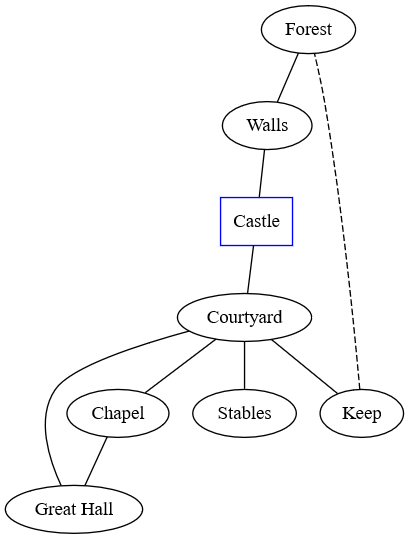
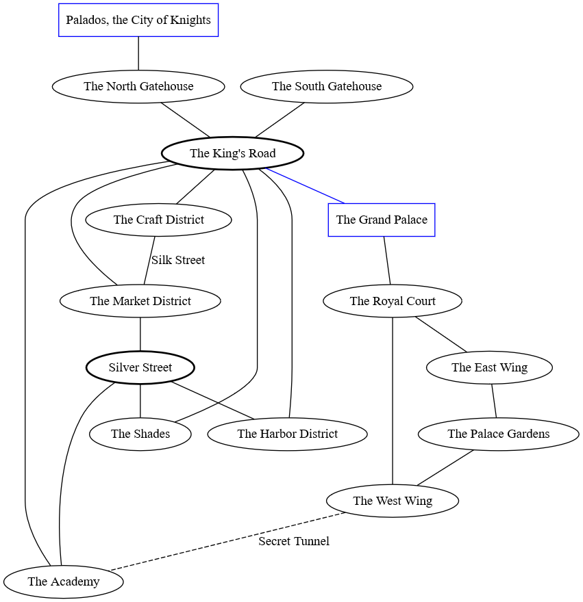

# Making Locations

Locations within the game of Mythmaker are areas of exploration and intimately spaced travel for the characters. When the adventure is on, the Storyteller will shift the game from the World Turn to the Local Turn as a result. This could take the form of a city or the form of underground ruins. 

In short, Locations are a series of areas connected by routes that the players will spend Move Actions to pass through during Local Turns. This section is designed to provide some guidance on how to create them, the hazards that might be found in them, and how to run them in your game.

## Story Goals

The first thing to consider when designing a Location is the **storytelling goals you wish to achieve with it**. This should be one sentence that describes why the players are going to the Location in the first place. For example, “to save the princess from the necromancer” is a good goal because it establishes the reason the players are going there (to save the princess) and also establishes what kind of resistance they should expect to find.

The best Story Goals come in the form of a response to a conflict or as an investigation to find information. 

## The Location Map

Locations are measured in terms of the number of Areas they have. An Area is essentially a section of the location that fulfills a particular purpose. For example, if a Fortress is a location, then the sleeping quarters of the guards might be one Area and the mess hall could be another. Each Area in itself is a piece of the location that should relate to the Story Goal in some capacity.

Let's keep using the Goal of “to save the princess from the necromancer” as an example. To start, we’ll say the Location in question is the necromancer’s castle. The map below is an example of a Location map that you would use to handle moving the players from one Area to the next. Once the players have arrived in one of the exterior points of interest, the game would shift from the World stage to the Local stage where moving from one Area to another costs one Move Action.

In a Location map, places represented by **Ovals** are considered points of interest. Points of interest are connected by **lines** representing routes from one point to another. Each point offers an opportunity to set the scene and provide players with information as they move along. Consider what information the players might receive when they get to the Forest. Perhaps they are able to see that torches light the walls around the Castle and that armed men are patrolling it. Or maybe the Forest itself has suffered and begun to wither as a result of the necromancer’s magic. With each point of interest that the players explore, you as the Storyteller should introduce the other points of interest connected from where they are.

**Squares** are used to represent larger structures that contain points of interest within them. In this example, the Castle is merely a container for points of interest once the players get past the walls.

**Dashed lines** (-----) are used to represent secret passages from one point of interest to another. In the map above, the castle being used by the necromancer was outfitted as a strategic point against incoming invasions and so a secret passage was engineered to allow the inhabitants a secret escape into the forest should the structure ever be overrun. This also presents an opportunity to give inquisitive players a hook early on when they investigate the castle and potentially learn of this fact. 

The Location map is for _your own reference _ as Storyteller. Do not give the players access to this map and instead invite them to create their own as they move around. Doing so is a good way of getting your players engaged with the map and letting them feel as though they are exploring a place for the first time. However, there are exceptions to this if your players are clever and inquisitive enough to investigate information about the Location beforehand. Maybe they spend some of their Wealth to buy an old map of the place or spend time to find the architect who built it. If the players seek out the means to obtain the layout of the Location map, then feel free to give it to them.

When designing points of interest, think about what kind of challenges or information the players can expect to find there. For example, in the Walls area, the obvious challenge to the players is not only surpassing the wall but also possibly evading the detection of the guards. This could call for using Strength to scale the wall as well as Stealth to do so undetected. And even once the players get within the castle, perhaps there are guards all around to make sure that the necromancer and the princess are kept well protected. In the same token though, the players could go to the Stables and find a stablehand who has been mistreated by the necromancer and will offer the players information on where the necromancer and princess are currently being kept.

### Adding Route Obstacles

Location Features are aspects of a point of interest that provide a general challenge against Movement. Using the necromancer’s castle again, imagine if there was a pile of rubble on the route from the Courtyard to the Keep with a Challenge Rating of 3. This means that in order to move through this Route, the players would each need to make a Body Test to overcome the rubble. If a player fails to meet the CR, then they would need to spend vigor to match the challenge rating. Or perhaps a key door that links one point to another is locked and can only be opened using a Thieves Kit and a high enough Finesse Test.

Review the Challenge Type section in the beginning of the book for inspiration on possible challenges to present to the players.

### City Location Maps

Location Maps can also be used to represent cities and urban locations as well. Below is an example of a Location Map that you might expect to see for a reasonably sized city. The bolded Ovals represent major thoroughfares that connect other points of interest together. The more points of interest that you add to a Location map, the more a place will feel alive as well as intriguing for the players. 

### Adding Routes & Shortcuts

The edges and routes that you add to a Location map will represent your way of moving from one point to another. But it’s entirely possible that the players will try exploring alternative ways to get to their destinations. 

For example, consider a case where the players are in the city of Palados and want to find a shortcut between the Market District and the Harbor District. This might call for an **Insight Test** against however difficult you think moving around the city is. If they succeed, they’ve established another way of reaching the Harbor District without passing through Silver Street. Not only do the players get to add to the Location map, but now you’ve got one more avenue to add additional points of interest. Perhaps a pass through that shortcut at a later date reveals a supernatural item shop for them to explore later on.

Or if the characters need to reach the second floor of a structure, using a ladder would provide a shortcut that would bypass the need for a Test altogether.
