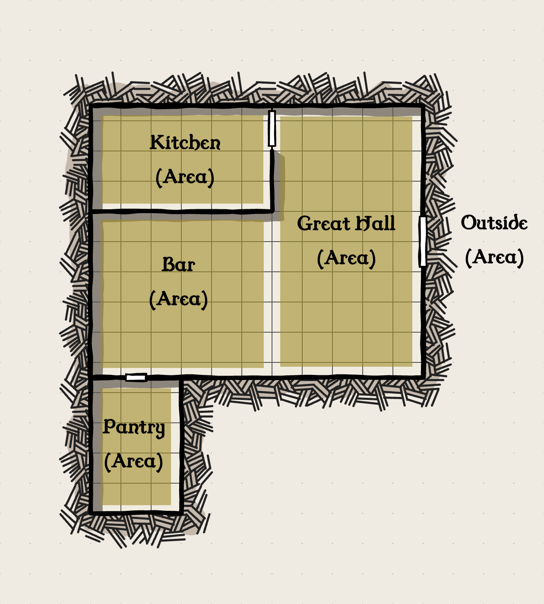

# Engagements

Engagements are used to fast-paced or time critical events. While combat is the first intuitive notion for engagements, they also encompass perils, chases, and other extreme situations where the order of action matters.

## Surprise

At the beginning of an engagement, the Storyteller evaluates if a surprise is able to be granted. Most forms of surprise occur when one group in stealth chooses to start the engagement towards another oblivious group.

When a surprise occurs, all creatures involved in the surprise gain one Engagement turn to perform Engagement Actions. All creatures targeted by the surprise cannot perform Actions and can only muster as much resistance towards Contested Actions as their passive abilities and armor allow. Once all creatures initiating the surprise have gone, all involved parties are added to the Turn Order.

## The Turn Order

After all surprises have been handled, all players and opposing forces involved in the engagement are sorted in descending order according to their Wits rating. In Mythmakers, the order of actions is determined by those who can mentally react the quickest.

During this stage, players can choose to bolster their Wits rating by spending vigor to increase their position in the order.

In a tie, the player characters have superiority, meaning that if a player and an opposing force earn the same result, then the player goes first. If two players tie with one another, then they can decide between themselves who goes first.

## The Engagement Turn

Engagement turns have their own special time span known as _moments_. A moment passes when everyone involved in the Engagement has had their chance to perform an Engagement Action. On a given Turn, a creature can make three Free Actions, make Contested Actions, and as many Move Actions as they are capable of taking.

As mentioned in the Myths & Dice section, there are three kinds of Actions: **Free Actions**, **Contested Actions**, and **Move Actions**.

### Free Actions
A Free Action is an action that has no obstacles associated with it and costs no vigor. In an Engagement, a given creature can only make three Free Actions per Turn.

| Free Action | Description                                                                                                                                                                                                                                                                                                                                                   |
| ----------- | ------------------------------------------------------------------------------------------------------------------------------------------------------------------------------------------------------------------------------------------------------------------------------------------------------------------------------------------------------------- |
| Speak       | Speaking within an engagement produces a short amount of dialogue that can be used to signal intent, speak with the opposing party, or relay information to one's allies. When a creature uses a Free Action to speak with another creature, the receiving creature may reply for free without consuming their own Free Actions.                              |
| Perceive    | Perceiving allows a character either to make an Insight Test to overcome a hindering element of the environment or make an observation and acquire details about a present area, creature, or object. If they possess a relevant knowledge or profession, they can also make an Insight Test to learn any details or clues regarding a creature or situation. |
| Rest        | A rest allows a creature to increase their Recovery and Wounds by 1. This is negated if the character spends vigor, takes wounds, makes a Contested Action, or makes a Move Action during their turn.                                                                                                                                                         |
| Interact    | Drawing a weapon, opening an unlocked door, or grabbing an object from a character's own pack                                                                                                                                                                                                                                                                 |
| Use Item    | Using an item other than a weapon such as a potion or a specific tool.                                                                                                                                                                                                                                                                                        |

### Contested Actions
Contested Actions are actions that are obstructed by some obstacle and require the use of a Test and possibly even vigor in order to overcome them. A given creature can only start one Contested Action per Engagement turn.

When a character starts a Contested Action against a target, they make a Test to generate pressure based on the action they are performing. Pressure is negated by a target's resistance towards that given type which can either be generated during the initial Test or during the target's Turn.

When everyone in the Turn Order has gone, all pressure placed upon a character is accounted for with different types of pressure resulting in different effects.
| Pressure | Effect |
|-|-|
|Physical Pressure|Subtracts from a character's Vitality rating. If a character's Vitality rating reaches 0, then any further pressure is subtracted from their vigor instead and must make Resolve Checks to stay conscious|
|Natural Pressure|Mainly consists of Fire, Cold, and Acid. Fire Pressure, Cold Pressure, and Acid Pressure are accounted for individually. Seek their entries in the Impairments section for more information.|
|Impairing Pressure|A character receives an impairment during their next Turn equal to the amount of Impairing Pressure they have received. The effects of this depends on the specific Impairment which can be found in the Impairments section|

| Contested Action | Description                                                                                                                                                                                                                                                                                                                 |
| ---------------- | --------------------------------------------------------------------------------------------------------------------------------------------------------------------------------------------------------------------------------------------------------------------------------------------------------------------------- |
| Use Weapons      | Use held armaments to make Weapon actions equal to the number of held weapons in order to either create physical pressure towards another creature or create resistance against incoming pressure. The Weapon actions available character has available to them depends on the held Weapon’s class (Melee, Ranged, Shield). |
| Impair           | Apply an Aspect to create conditional pressure.                                                                                                                                                                                                                                                                             |
| Maneuver         | Apply an Aspect to perform a special maneuver                                                                                                                                                                                                                                                                               |
| Retreat          | Signal a Retreat that other players can immediately respond to. This turns the Engagement into a Chase.                                                                                                                                                                                                                     |
| Focus            | Use a Supernatural Practice to create a supernatural effect by spending vigor or resources to accrue focus points.                                                                                                                                                                                                          |

#### Use Weapons
A character can make a number of Weapon Actions equal to the number of held weapons in their hands. A swashbuckler wielding a rapier in one hand and a dagger in the other, for instance, can make two Weapon Actions. A berserker wielding just a single greatsword on the other hand would only be able to take make one Weapon action.

##### **Standard Melee Weapon Actions**
| Weapon Action | Invoked Aspect | Creates...          |
| ------------- | -------------- | ------------------- |
| Slash         | Strength       | Physical Pressure   |
| Pierce        | Finesse        | Physical Pressure   |
| Bludgeon      | Strength       | Physical Pressure   |
| Throw         | Finesse        | Physical Pressure   |
| Brace         | Strength       | Physical Resistance |
| Parry         | Finesse        | Physical Resistance |

##### **Standard Ranged Weapon Actions**
| Weapon Action | Invoked Aspect | Creates...        |
| ------------- | -------------- | ----------------- |
| Aim           | Finesse        | Base Range        |
| Loose         | Finesse        | Physical Pressure |

##### **Standard Shield Weapon Actions**
| Weapon Action | Invoked Aspect | Creates...          |
| ------------- | -------------- | ------------------- |
| Bludgeon      | Strength       | Physical Pressure   |
| Throw         | Finesse        | Physical Pressure   |
| Brace         | Strength       | Physical Resistance |
___
Slash, Pierce, and Bludgeon are standard weapon actions that allow a character to invoke the aspect associated with them towards creating physical pressure. Physical pressure is potential damage that a target may receive at the end of the Engagement Turn when all pressure is added together. 

If a character satisfies the Strength Requirement of a given weapon, they can use the weapon's size rating as Enhancement towards the Test. A weapon will state which of the three actions its capable of performing. It is possible to attempt make a weapon action a weapon is not normally capable of but doing so results in the Test being hindered by 1.

The target on the receiving end of this physical pressure must then make an Armor Test. If the target's Armor Set has a physical vulnerability to the Weapon Action being made against them, then the Armor Rating of the Armor Set is rolled to generate resistance. However, if the Armor Set does not have a physical vulnerability to the Weapon Action, then the target's Armor Rating acts as the de facto challenge rating. If the amount of physical pressure created is more than the resistance of the target, then the target is *under pressure* and cannot use their Move Actions to shift away until the pressure is negated either on their turn or by an ally.
___
Brace and Parry are standard weapon actions that allow a character to invoke the aspect associated with them to create physical resistance. If a character is under pressure, then they must use a Weapon Action to Brace or Parry to try and remove pressure if they wish to move around freely.
___
Throwing can be performed on any object. In order to throw a weapon or item at a target, the target must be within the throwers base range. The default base range for any creature is anything within the same zone. A creature's base range increases by 1 zone for every point that their Strength exceeds the object's size rating that they are trying to throw. However, if this condition is not satisfied, the creature can make a Contested Action to make a Strength Test with the object's size as the challenge rating. If they succeed, they can throw the object one additional zone away from where they are.

Once a target is inside the base range, the creature making the throw makes a Finesse Test. If the creature's Strength Rating is less than the size rating of the object, then the Finesse Test is hindered by the object's size rating. However, if the throwing creature's Strength is equal or greater than the object's size, then no hindrance is applied. The type of Weapon Action being performed on the target is whatever makes sense in the moment. For example, if a mug is being thrown at a rowdy tavern patron, then Bludgeon applies. However, if someone is throwing a dart or a dagger, then Pierce applies.

#### **Impair**
The Impair Action can be used to give a target an Impairment. Impairements are status conditions that can actively hinder a target without causing direct damage. To create Impairing Pressure, a player describes how they want to cause a specific impairment. Then the Storyteller answers with the kind of Test they would need to make.

Generally, it can be assumed that physical impairments will require a physical aspect to be invoked. When the test is made, the target of the action makes a corresponding Test with a physical aspect of their choice.
|Test|Resistance|
|-|-|
|Physical Aspect (Strength, Finesse)| Physical Resistance (Strength, Finesse)|
|Mental Aspect (Resolve)|Mental Resistance (Resolve)|

If the target receives excess pressure, then the target is considered *under pressure*. Unlike physical pressure, impairing pressure comes into play the moment it is created. This means that if a creature receives pressure towards the Stunned impairment, any subsequent Tests would be affected by the impairment as if they had ranks in it.

##### **Physical Impairments**
|Impairment|Description|Effect|
|-|-|-|
|Staggered|A staggered creature walks unsteadily or has lost their balance. A fully staggered creature can be considered prone|Actions that use physical aspects are hindered equal to the rank of this impairment. The creature is also unable to perform actions that require at least two hands.|
|Stunned|A creature has received a concussive blow and is unable to react physically or mentally|Actions that use physical or mental aspects are hindered equal to the rank of this impairment. If a creature reaches the maximum rank of this Impairment, they become unconscious|
|Restrained|A creature is being grappled or subdued in some way, shape, or form|Actions that use physical aspects are hindered equal to the rank of this impairment. If a creature is actively restraining another, then both creatures occupy the same area for the sake of determining targets. Creatures with the restrained impairment are unable to move|
|Blinded|A creature's vision has been impaired or subjected to total darkness and cannot see|All actions that require sight are hindered equal to the rank of this impairment|
|Deafened|A creature's sense of hearing has been muffled or damaged as a result of a loud sound|All actions that require hearing are hindered equal to the rank of this impairment|
|Silenced|A creature is gagged or unable to speak properly due to interference|All actions that require the ability to speak are hindered equal to the rank of this impairment|
|Poisoned|A creature has been subjected to a poison|The effects of a poison depend on the nature of the specific poison|
|Diseased|A creature has been placed in contact with a disease|The effects of a disease depend on the nature of the specific disease|

##### **Mental Impairments**
|Impairment|Description|Effect|
|-|-|-|
|Troubled|A creature has been exposed to a personal trouble of theirs or has had a trouble creatued for them through supernatural means|All actions are hindered equal to the rank of this impairment|
|Distracted|A creature's attention has been rapt by an entrancing pattern or been pulled by a grabbing display|All actions made towards a target other than the source of the distraction are hindered equal to the rank of this impairment|
|Frightened|A creature has been intimidated or supernaturally frightened|All actions made against the source of fear are hindered equal to the rank of this impairment. A creature cannot move closer to the source of the fear.|
|Charmed|A creature's disposition towards another has been altered or they have been supernaturally given an Ideal to follow|All actions that act contrary to the Ideal are hindered equal to the rank of this impairment|
|Confused|A creature's wits are unable to process what is before them or have been supernaturally altered|All actions are hindered equal to the rank of this impairment|

##### **Natural Impairments**
|Impairment|Description|Effect|
|-|-|-|
|Burning|A creature is on fire|On the World’s Turn, a creature receives Wounds equal to the rank of this impairment and then this impairment's rank increases by one. The quality rating of a creature’s Armor Set and Apparel decreases by one for each Round this impairment remains on the creature.|
|Freezing|A creature is exposed to cold pressure|On the World’s Turn, a creature loses vigor equal to the rank of this impairment. If a creature’s vigor is reduced to zero, then the creature receives Wounds equal to the rank of this impairment instead. Actions that use physical aspects are hindered equal to the rank of this impairment|
|Suffocating|A creature is unable to breathe|On the World’s Turn, a creature loses vigor equal to the rank of this impairment. If a creature’s vigor is reduced to zero, then the creature receives Wounds equal to the rank of this impairment instead. Actions that use physical aspects are hindered equal to the rank of this impairment|
|Petrifying|A creature is being turned into stone or some other materia|On the World’s Turn, a creature loses vigor equal to the rank of this impairment. If a creature’s vigor is reduced to zero, then the creature receives Wounds equal to the rank of this impairment instead. Actions that use physical aspects are hindered equal to the rank of this impairment|

**Assists**

If a Contested Action was started by another player or creature during a Round in the Engagement, then another player or creature can contribute to the Contested Action by using their Turn to add to the side of the Contest they wish to assist with.

For example, if one character made a Slash Weapon Action towards a creature on one Engagement turn and created 4 points of Physical Pressure and then another character on their turn made a Slash Weapon Action to create 2 additional points of Physical Pressure, then both would be accumulated together to make 6 points of Pressure.

#### Maneuvers

Maneuvers are special Contested Actions that allow characters to influence another creature’s positioning through the use of Aspects. The effects of maneuvers happen immediately.

**Shove**

A Shove maneuver is used to push another creature or object from one zone to another. In order to perform a shove, the shoving creature must make a **Strength Test** which can be resisted if the target is active. The target can then make a Test to resist using a physical aspect or supernatural ability. If the shoving creature earns more successes than the target, then the target is immediately shoved into one adjacent zone of the shoving creature's choosing. For each increment that the shoving creature surpasses the target's resistance, the shoving creature can choose to move the target one additional zone.

If the creature or object has a larger size rating than the shoving creature, then the Test to shove is hindered by the number of size steps.

**Charge**

A Charge maneuver is used to give Enhancement to an action through the use of movement along a surface. In order to make a Charge, a creature uses their Move Actions to move through a number of connected zones. The character then gains Enhancement to their next Contested Action equal to the number of zones they have moved across to reach their target. However, any Contested Actions made against the charing creature also gain an equal amount of Enhancement.

A character under pressure cannot make a Charge until the pressure has been fully resisted.

**Plummet**

A Plummet maneuver is used to give Enhancement to an action through falling. In order to use a Plummet, a character must fall from one zone into another. 

Once this has been accomplished, a creature can use their Size rating as Enhancement towards their next Contested Action.

**Swap**

A Swap maneuver is used when one character wants to switch places with another. Both characters must be within one Size Step of one another and must be within the same zone in order for a swap to occur. This consumes a Move Action from both participants. Any pressure that was on one character gets transferred to the character swapping in.

### Move Actions
A Move Action allows a creature to move from one zone to another. A zone is a defined area within a given location. For example, the image below depicts a tavern broken up into a number of zones. During your Turn, you can move a number of zones equal to your character’s Size rating plus their Endurance rating. A character can move beyond this allotted amount by spending one point of vigor and subtracing one point from Recovery for each additional zone traveled.

|Move Action|Description|
|-|-|
|Move into Cover|Spend a Move Action to shift behind available cover in a given zone. The Storyteller will describe what is available to you and how much cover it provides. Generally, only one creature can occupy a source of cover unless otherwise stated. A cover's provided size rating acts as Enhancement towards any Armor Tests or Contested Actions made while in cover. However, melee weapon actions are hindered equal to the size rating of the cover while it is in use|
|Leave Cover|A creature behind cover must spend a move action to move out of cover in a given zone. The creature loses the benefits of cover but their melee weapon actions are no longer hindered|

### Delay Turn
A delay allows a creature to suspend their turn until after another creature in the turn order has gone. A delayed Turn can only be started after another creature has already performed their actions. The character's placement in the turn order resets once a new Turn has been started.

Delaying a Turn can prove useful when coordinating efforts against particular foes or for observing how an Engagement unfolds before choosing to step in.

### Retreating
A Retreat is a special Action that a player can declare during an Engagement to signal an escape. When a player signals a Retreat, all other players in the Engagement can choose to participate in the Retreat or remain in the Engagement.

Players that join the Retreat immediately take their Turn after the signaling character even if their Turn has already gone. Retreating characters cannot make Contested Actions to cause Pressure and can only make Move Actions.

Players that remain in the Engagement continue to follow the established Turn Order until they either Retreat themselves or become unable to.

## The World Turns
Once all active participants in the Engagement have had their Moment, the World Turns. During this Turn, all participants in an Engagement take any Pressure they have accumulated during the Round and subtract generated Resistance. If there is a margin of Pressure, the margin added to a character’s Wounds rating. If the amount of Wounds a character has received exceeds their Death’s Door threshold, then they subtract an amount of vigor equal to the margin and reset their Wounds rating to the threshold.

For example, if a character was successfully hit by a burning Torch during the Round and received Fire Pressure, they will add the amount of Fire Pressure to their Wounds rating.

Once all Pressure has been applied, all Pressure generated in the Round is reset to zero.

## Recovery
Once the World Turns, all active participants in the Engagement gain Recovery. A character regains vigor equal to their Recovery rating.

Characters suffering from Impairments can make Endurance Tests and Resolve Tests to recover from Physical and Mental Conditions respectively. The amount of successes earned from a Test reduces the inflicted Condition’s rank by the achieved amount. 

Only one Physical Condition and one Mental Condition can be recovered in this fashion. For example, if a character gained the Staggered Condition and the Stunned Condition during a Round, they must choose which Condition they are going to apply their Endurance Test towards during Recovery. However, if a character is both Stunned and Distracted, then they can make both an Endurance Test and a Resolve Test during Recovery.

## Size Steps
Size plays an important factor in the world of Mythmakers, as some creatures can be as tall as giants or as small as fairies. When taking Actions against such creatures, one needs to know the size step. The size step is the difference in size (or “steps”) between two creatures.

When two creatures of the same size interact, the size step becomes 0. However, if an Average person were to face against a Giant creature, then the size step becomes 1. See the table below for more examples.

| SIZE     |
| -------- |
| Mini     |
| Tiny     |
| Little   |
| Small    |
| Average  |
| Giant    |
| Huge     |
| Colossal |
| Mythical |

Larger creatures can use the size step as *enhancement* towards actions that use physical aspects, whereas smaller creatures can use the Size Step as *resistance* against actions that use physical aspects.

## Ending Engagements
There are four conditions that can end an Engagement:

* **Surrender** - When all active creatures in a group decide to end the engagement, leaving their fate in the hands of another group. For example, a group of creatures may all decide to appeal to mercy or a parley.
* **Defeat** - When there are no more active creatures of a group left to contribute to the engagement.
* **Natural Causes** - When there is no way for creatures to interact with each other in the engagement. 
* **Retreat** - When a group of creatures have fled from the area of Engagement.

When an Engagement ends, the stage of play shifts back to the Exploration stage.
