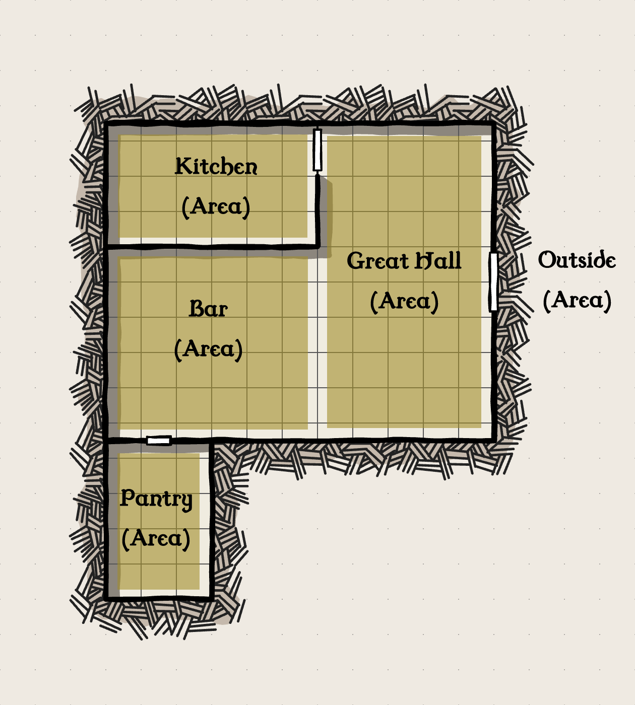

# The Natural World
The purpose of this section is to explain portions of the natural world in relation to the game itself.

## Natural Damage

Natural Damage represents the range of natural damage types that can be found in the Natural World. Unlike Physical Damage, which comprises Slashing, Piercing, and Bludgeoning, Natural Damage inflicts wounds and conditions.

**Fire** - Creatures that take Fire damage receive wounds equal to the level of Fire produced and gain the Burning condition equal to the level of Fire.

**Cold** - Creatures that take Cold damage receive wounds equal to the level of Cold applied and receive the Freezing condition equal to the level of Cold.

**Acid** - Creatures that take Acid damage receive wounds equal to the level of Acid applied. If the level of Acid is more than a creature’s Armor Set’s Natural Resistance, then the creature selects a piece of the Armor Set and reduces its quality equal to the difference.

## Vision

Light in Mythmaker is either illuminating or hindering depending on the creatures interacting with it. Fully Hindered indicates that any Test made during Daylight or Night for a given creature is hindered by 6. Torchlight or any light source that casts a radiance allows a creature with Common or Far Sight to act normally as long as they stay within the zones illuminated by the light.

Actions made within an unlit zone are hindered by six. However, Actions made against creatures or objects within a lit zone do not suffer the same penalties as long as the creature performing them can influence the zone such as with ranged weapons or supernatural effects.

| Vision       | Daylight       | Night          |
| ------------ | -------------- | -------------- |
| Common Sight | --             | Fully Hindered |
| Dark Sight   | Fully Hindered | --             |
| Far Sight    | --             | Fully Hindered |

### Land

In the world of Mythmakers, there are fifteen types of terrains: **Grassland, Forest, Tundra, Coast, Desert, Mountain, Swamp, City, Underground, or Unique**

In each Land is a variety of obstacles that can obstruct movement, restrict vision, or even test one’s fortitude in the form of its climate.

## Falling

Falling is one of the most common hazards associated with Perils. When a creature falls, the scene immediately transitions into an Engagement.

Because Falling is a result of a natural force, any movement from falling takes place during the World’s Turn upon which they descend one zone's worth of movement. If the creature descends into a zone with a floor, then they will receive physical pressure equal to the number of zones they moved between multiplied by their Size rating.

An able creature can attempt to resist some of the physical pressure by making a **Finesse Test**. If the physical pressure exerted is enough to surpass the falling creature's Health rating and remove all vigor afterwards immediately dies from the impact.

## Stealth

Stealth in Mythmaker is a developing contest between the creatures in stealth and the parties they are avoiding detection from. For the purposes of describing how Stealth works, the creature in stealth will be referred to as a Rogue and the creature on the other side will be referred to as an Observer.

A Rogue begins Stealth by making a Finesse Test. The result of this Test acts as the creature's Stealth rating as they move around a location and shift between areas. During Stealth, a creature uses their Move Actions to shift from one location to another as if they were using Local Actions.

For example, the tavern below would serve as a Location that contains multiple areas within it.

>A target the party is after has been discovered to be hiding somewhere within a tavern. A member of the party becomes a Rogue and makes a Finesse Test to begin stealth.

If a Rogue enters a location that also contains other creatures, then their Stealth rating is compared against the unmodified Sense ratings of the creatures within the location.

An Observer begins Stealth in the state *oblivious*. They are unaware of the Rogue and go about their routines as normal. A Rogue in this situation is *undetected* and gains the following abilities:
- An undetected Rogue gains the ability to start an Engagement and initiate a Surprise.
- An undetected Rogue gains enhancement on the first Contested action they take against an observer equal to their current Stealth rating.

A Rogue's actions while in stealth consume Move Actions. With these Move Actions you can perform the following Stealth Actions.

|Stealth Action|Description|
|-|-|
|Move into an Adjacent Area|Spend a Move Action while in Stealth to move from one Area to an adjacent Area|
|Interact with an Area|Spend a Move Action to Interact with an Object in the current Area. Any activities such as picking a lock while avoiding detection requires a separate Finesse Test|
|Hide|Spend a Move Action to take cover or move into an available hiding spot. Make a new Stealth Test against an Observer's Sense Test. If you succeed, then you can spend a Local Action to reduce the level of detection from Wary to Oblivious or you can spend a World Action to reduce the level of detection from Alert to Wary|

### Stages of Detection
|Awareness|Description|
|-|-|
|Oblivious|A stealthing creature can start an Engagement with a surprise. Stealthing creatures can use their Stealth rating as Enhancement on their next action if they start an Engagement|
|Wary|A stealthing creature cannot start an Engagement with a surprise. Stealthing creatures can use their Stealth rating as Enhancement on their next action if they start an Engagement. The observing creatures are now aware of a presence nearby. The observing creatures can start a Detect Contest. The stealthing creature must invoke their Finesse rating while the observing creatures invoke their Sense rating. If the observing creatures succeed the Contest, they learn which zone the disturbance came from and become alert. Otherwise, they remain Wary|
|Alert|A stealthing creature cannot start an Engagement with a surprise. Stealthing creatures cannot use their Stealth rating as Enhancement on their next action if they start an Engagement.|

If multiple creatures are in stealth together, then all creatures must make a Finesse Test individually. The creature with the lowest result represents the group as the group moves around a location. If a Detect Contest is started, every creature in the group needs to make a Finesse Test with the lowest acting as the result against the Sense Tests of each member of the observing group.

## Camping
Camping occurs when one or more characters forgo the services offered up by a local tavern or homestead to sleep on their own. There are two parts to camping: Establishing Camp and Keeping Watch.

### Establishing Camp
A camp has two main components: Comforts and Lighting. Comforts come from good food, good company, merriment, and a fire. All of these come from a group effort of forming the camp. To make a camp, a character must make an action that assists in one of these aspects.

A camp begins with a quality rating of zero. Any successes obtained from a given action add to the quality in the form of marks. When six marks are achieved, the camp's quality improves by 1. Then all marks are reset before any further successes are added.

In order to make a fire, a character must possess a rating in a relevant profession or an item in their inventory to facilitate it. If an item is used, then the player must make a Usage Test. Then the characters determine what size of fire they want. The size rating of the fire represents the amount of fire pressure it can exert as well as the amount of lighting it can give off. A size rating of 1 will light the current zone with each increase extending its visibility by another zone. The size rating is added directly to the quality of a camp.

Once the camp has been fully established, the quality rating of the camp acts as free enhancement dice that can be used towards any given Test in the next six turns.

If the camp is made in the wilderness, then the camp itself becomes a zone.

### Keeping Watch
The second part of making camp is establishing a watch. Many dangers lurk and crawl around in the wilderness and so a guard is necessary to keep aware of their presences.

Keeping Watch counts as a World Action and allows a character to make a Sense Test as if they were an Observer. If more than one character Keeps Watch, they can assist one another towards this Test. If the camp has a fire, then this test is enhanced by the size rating of the fire.

If a character detects another creature or presence, then a number of zones are added to the map to reflect its distance away from the camp.

Characters keeping watch will only have visibility in a number of zones equal to the size of the fire during nightfall.